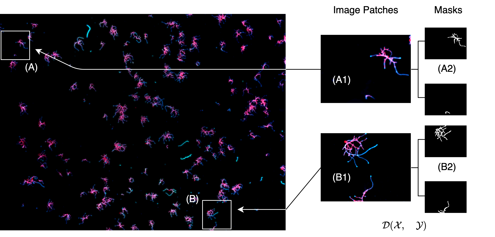
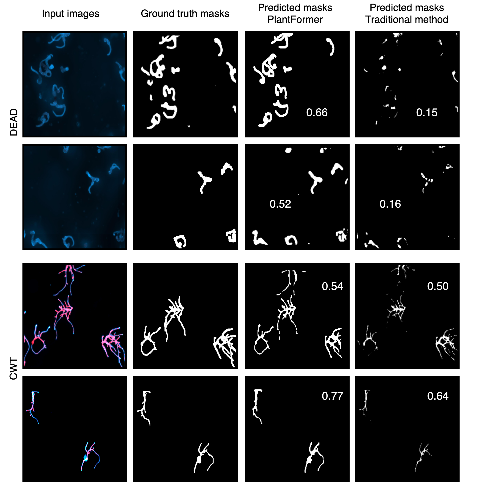

<h1 align="center">
  &nbsp;SegPlantFormer 🌱🔬<br>
</h1>
<h2 align="center">
A Transformer-Based Model for Plant Semantic Segmentation&nbsp;
</h2>

----

<a href="https://alkzar.cl/EVIC23_poster_segplantformer.pdf" target="_blank">[EVIC23 Poster]</a>
<a href="https://api.wandb.ai/links/alcazar90/7k7k0yph" target="_blank">[W&B blogpost]</a>
<a href="https://github.com/alcazar90/plant-segmentation/blob/main/single-segmentation.ipynb" target="_blank">[Usage]</a>

About this project;

> TBC

<figure>
  
  <figcaption><small>Fig. 2. <br>Left:</br> The results of the laboratory experiments are captured in a large stacked image (25036 × 18954px) with high resolution microscopic imaging. The white squares with labels Aand B are samples that were taken. <br>Right:</br> Smaller image patches from the samples, such as (A1) and (B1), are the input images for the model. Then, we manually handcraft masks with semantic information from these images regarding the plant shapes associated with alive/dead cell labels (A2 and B2), elaboratin the dataset D</small></figcaption>
</figure>


<figure>
  
  <figcaption><small>Fig. 5. Compares approaches between two subsets: the top rows display input image from the <br>dead</br> dataset, and the bottom rows depict from the <br>CWT</br> dataset. The IoU metrics are displayed within the images in columns 3 and 4. The model consistently outperforms the traditional method in almost all test cases, as seen in the first row, where the predicted mask achieves 0.66 IoU compared to the traditional method’s 0.15 IoU. These observations were not used to train the model.</small></figcaption>
</figure>


## Get Started

TBD: Los _checkpoints_ con los modelos se encuentran en el directorio `ckpt`.


## Future Work

TBD


## Citing

```
@misc{TBPlantSegmentation,
  authors = {Alcázar, Cristóbal}, {Chocano, Edward}, {Flores, Ricardo}
  title = {SegPlantFormer: A Transformer-based Model for Plant Semantic Segmentation},
  year = {2023},
  publisher = {GitHub},
  journal = {GitHub repository},
  howpublished = {\url{https://github.com/alcazar90/plant-segmentation}},
}
```
