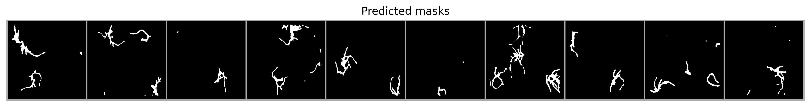
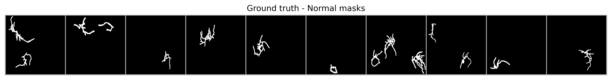
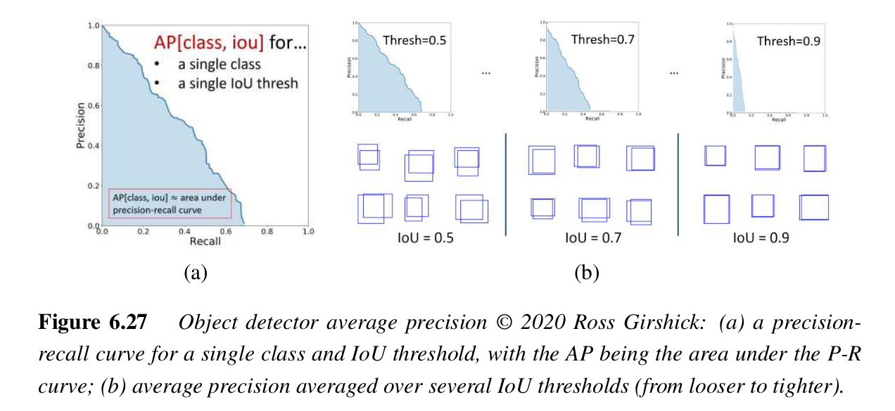
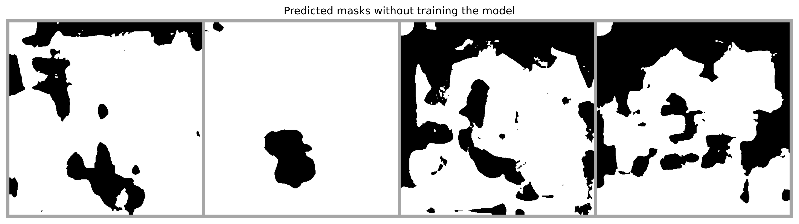
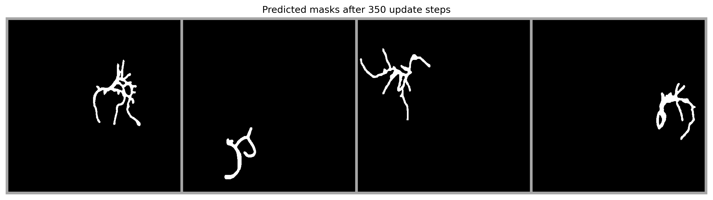
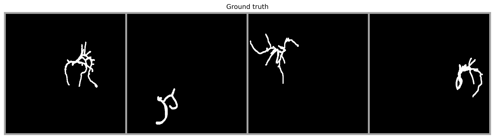

# Plant Segmentation

Documento en [Overleaf](https://www.overleaf.com/project/64949881099e3cb9a6fce834).

## TODO

- [X] Agregar _script_ `train.py` para entrenar modelos binario (vivo/muerto) para los datasets `cwt` y `dead`
- [X] Computar la función de pérdida en conjunto de validación
- [ ] Agregar _logging_ W&B
- [ ] Completar secciones del documento
- [ ] Computar Métrica _precision_ y _recall_ a partir de _threshold_ en IoU
- [ ] Computar y gráficar curva _precision_ - _recall_ para varios _threshold_ de IoU
- [ ] _Script_ para entrenar modelo multi-clase 


## Logbook

#### 25/06/2023

Agregar logging de W&B...


#### 24/06/2023

**Respecto a revisiones de la clase `PlantDataset`**. Se verificaron que las máscaras actuales para el _dataset_ `dead` estuvieran acorde a la estructura de carpeta. A pesar de que no hay cobertura completa de etiquetado, el _dataset_ funciona según lo esperado. Ahora se puede utilizar la misma clase para instanciar el _dataset_ `cwt` y `dead` con el mismo código.

Se actualizó `PlantDataset.get_masks_per_labels` para usar una expresión regex e identificar el tipo de máscaras por el label en su nombre según el diccionario `self._label2id`, antes se encontraba hardcodeado para el _dataset_ `cwt`.

```python
def get_masks_per_labels(self):
    """ Return the number of masks per label """
    pattern = ''.join([s + '-|' if idx < len(self._label2id)-1 else s for idx, s in enumerate(self._label2id.keys())])
    get_label = lambda x: re.findall(pattern, x)[0].replace('-', '')
    out = [get_label(m) for img in self.masks for m in img]
    return np.unique(out, return_counts=True)
```

**Respecto al entrenamiento del modelo**. Se creó el archivo `train.py` donde tiene solo el código necesario para entrenar un modelo y computar métricas durante el entrenamiento. Se computa _intersection over union (IoU)_ para monitorear y realizar _early stopping_, usando el conjunto de validación. Lo anterior, es posible gracias a la función `get_pred_label` del archivo `evaluation.py` que recolecta en modo inferencia las predicciones, etqiuetas, y logits de todas las observaciones en un dataloader.

```python
# Collect predictions, labels, and logits from all observations in a dataloader
val_preds, val_labels, val_logits = get_pred_label(model, 
                                                   val_loader, 
                                                   device, 
                                                   return_logits=True)
```

Otras caracteristicas de `train.py` son:

* Utilizar modulo `argparser` para fijar los hiperparámetros y otras configuraciones de entrenamiento vía linea de comando.
* Computar métricas de entrenamiento al final de cada _epoch_.
* Computar métricas en validación dado X número de actualizaciones de gradientes que son monitoreados la variable `eval_steps`.
* Guardar _checkpoints_ del modelo cada vez que se logra mejorar la métrica _mean intersection over union_ de todo el conjunto de validación.
* Guardar la métrica IoU por observación en el conjunto de validación cada vez que se ejecuta el _pipeline_ de validación en el archivo `miou_<id>.csv` en la carpeta `results`.


Por ejemplo, podemos entrenar un modelo de la siguiente manera:

```bash
python train.py --bs 2 --epochs 20 --eval_steps 30 --lr 1e-3 --rep 2 --dataset cwt
python train.py --bs 2 --epochs 20 --eval_steps 30 --lr 1e-3 --rep 2 --dataset dead
```

Luego, podemos computar el mIoU a partir del archivo `miou_<id>.csv` directamente desde el terminal usando `awk`:

```bash
awk -F',' '{sum=0; for(i=2; i<=NF; i++){sum+=$i} average=sum/(NF-1); print average}' ./results/miou_1.csv
```

#### 23/06/2023

Se modificó la clase `PlantDataset(Dataset)` en `dataset.py` y se agregó un nuevo parámetro para inicializar la clase, `label2id`, que permite codificar los labels a partir de los nombres de las máscaras cuando se cargan a partir de las carpetas. Esto permite mayor flexibilidad para cargar las máscaras de los labels sobre distintos tipos de experimentos, tanto como `cwt` y `dead` que disponen de diferentes labels. A continuación se muestra un ejemplo de como se inicializa la clase `PlantDataset` dependiendo el caso:

```python
# Crear dataset con plantas vivas
label2id = {'normal': 0, 'normal_cut': 1, 'noise': 2}
cwt_dataset = PlantDataset('data', 'cwt', 'data_inventary.csv', label2id=label2id)

# Crear dataset con plantas muertas
label2id = {'dead': 0, 'dead_cut': 1, 'noise': 2}
dead_dataset = PlantDataset('data', 'dead', 'data_inventary.csv', label2id=label2id)
```

#### 15/06/2023

Luego de tener capacidad de memorizar un _batch_ de 4 imagenes (seccion anterior), y afinar un par de detalles en el loop de entrenamiento, se realizó _fine-tuning_ sobre el conjunto de datos completo. Se utilizó un _learning rate_ de `1e-3` y se entrenó por 300 pasos de actualización de parámetros. Se utilizó un _batch size_ de 2 imágenes, y se separó el conjunto de datos en 59 imagenes de entrenamiento y 10 para validación. 

Se monitoreo el _mean Intersection over Union_ (mIoU) sobre el conjunto de validación cada 25 pasos de actualización de parámetros, y se guardó un _checkpoint_ del modelo cada vez que se lograba una mejor métrica. Sin ajustes elaborados de hiperparámetros, se obtuvó un modelo que reportó un 0.53 de mIoU sobre el conjunto de validación.

En vez de continuar experimentando, y entrenando el modelo, se utilizó el _checkpoint_ anterior en la sección _"Load a checkpoint & compute metrics"_ para computar y analizar una evaluación más profunda del modelo.

Se utiliza `get_pred_label(model, val_loader, device)` para recolectar las predicciones del modelo y las etiquetas dado el dataloader del conjunto de validación. Esta información permite computar rápidamente el IoU por cada ejemplo del conjunto de validación.

```python
# Collect the predictions of a model and labels from a dataloader
preds, labels = get_pred_label(model, val_loader, device)

# Compute IoU per example
val_iou = compute_iou(preds, labels)
print("IoU per each validation example:\n")
val_iou
> IoU per each validation example:

> tensor([0.6895, 0.4673, 0.7664, 0.0026, 0.5333, 0.4500, 0.6005, 0.7132, 0.3637,
        0.6716])
```
<center>



</center>


* En general, los resultados son bastante buenos, 6/10 imagenes tienen un IoU mayor a 0.5, y 3/10 tienen un IoU mayor a 0.6.
* Se detecto un error en la máscara de la imagen 4, la que reporta un IoU de 0.0026. Esto se debe a que la máscara de la imagen 4 tiene un label `normal` que no coincide con la imagen original. Esto afecta el promedio de IoU general, y se debe tener en cuenta para futuras evaluaciones.
* Se observa en las imagenes 2, 5, 7, 9 que el modelo predice información adicional que no aparece en las mascaras, esto significa que el modelo esta prediciendo las otras mascaras con etiquetas `normal-cut` y `noise`. Por lo tanto, esto puede ser una buena señal si se incorporan estos masks adicionales para controlar esto, y significaría que la métrica IoU aumentaria en estos casos, considerando todo lo demás constante.

En la siguiente iteración, continuar mejorando la evaluación del modelo, y computar las siguientes métricas resumidas en la Figura 6.27 del libro de Szeliski, que se muestra a continuación:


<center>

</center>


#### 14/06/2023

El archivo `single-segmentation.ipynb` se puede entrenar un modelo sobre el conjunto de datos `cwt`, solo para detectar el label `normal`. En la creación del _target_ a partir de las máscaras, se utiliza `get_binary_mask` para convertir las masks asociadas al label `normal` en `1` y el resto de labels se convierten en 0. 

En la siguiente imagen se puede ver el resultado de la segmentación _overfitteando_ un batch de 4 imágenes con label `normal`:

<center>






</center>

Importante verificar luego del entrenamiento sobre el conjunto de datos completos, la influencia de elementos como `normal-cut` o `noise`.

Se deben tener la capacidad de computar la métrica de IoU para cada predicción, así luego ocuparlo tanto en el conjunto de validación y pruebas, para clasificar las predicciones dado cierto _threshold_ como correctas e incorrectas. Esto permitirá computar otras métricas como _precision_ y _recall_.


## Dependencias

### Segment Anything

- Instalación de [Segment Anything](https://github.com/facebookresearch/segment-anything), que permite utilizar los modelos de segmentación de imágenes entrenados por Meta de manera fácil. Para instalar la instalación se deben seguir los siguientes pasos:

    ```bash
    pip install git+https://github.com/facebookresearch/segment-anything.git
    ```

- Los _checkpoints_ con los modelos se encuentran en el directorio `ckpt`.


## Citing...

```
@misc{TBPlantSegmentation,
  authors = {Alcázar, Cristóbal}, {XYZ, Edward}, {Flores, Ricardo}
  title = {A Transformer-based Model for Plant Cell Semantic Segmentation},
  year = {2023},
  publisher = {GitHub},
  journal = {GitHub repository},
  howpublished = {\url{https://github.com/alcazar90/plant-segmentation}},
}
```