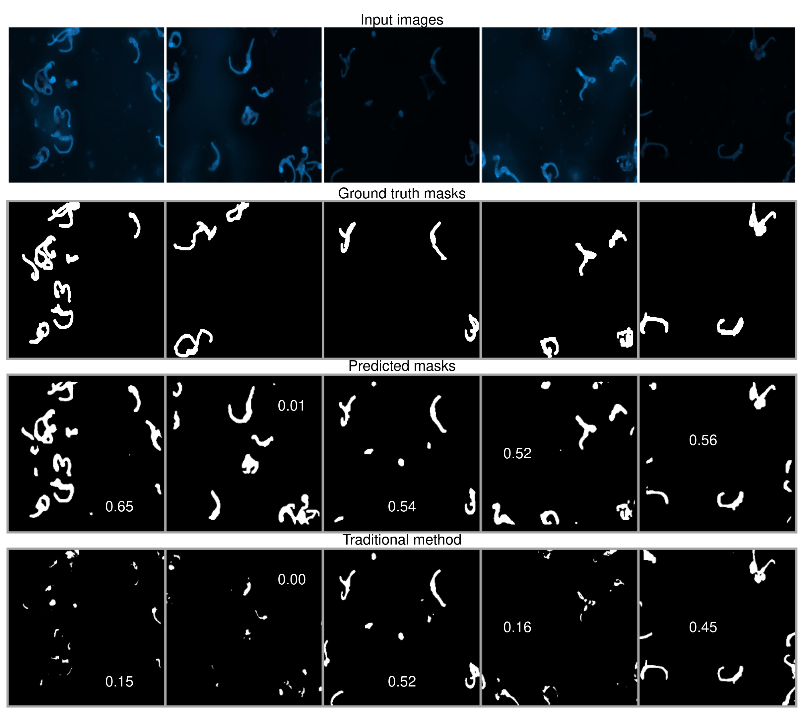

<h1 align="center">
  &nbsp;SegPlantFormer 🌱🔬<br>
</h1>
<h2 align="center">
A Transformer-Based Model for Plant Semantic Segmentation&nbsp;
</h2>

----

<a href="https://alkzar.cl/EVIC23_poster_segplantformer.pdf" target="_blank">[EVIC23 Poster]</a>
<a href="https://api.wandb.ai/links/alcazar90/7k7k0yph" target="_blank">[W&B blogpost]</a>
<a href="https://github.com/alcazar90/plant-segmentation/blob/main/single-segmentation.ipynb" target="_blank">[Usage]</a>

About this project;

> TBC

## Future Work

- [X] Agregar _script_ `train.py` para entrenar modelos binario (vivo/muerto) para los datasets `cwt` y `dead`.
- [X] Computar la función de pérdida en conjunto de validación.
- [X] Agregar _logging_ W&B.
- [X] Actualizar notebook `single-segmentation.ipynb` uso de función `get_pred_label`, y en cualquier otra parte que se utilice.
- [X] Guardar métrica mIoU de las observaciones en _training_.
- [ ] Usar mascaras de clases que no se van a predecir en modelo single-detection, para evitar que el modelo prediga mascaras de clases que no se van a predecir, y que afectan la métrica IoU. Usar las mascaras para apagar lo que no queremos ver de la imagen input.
- [ ] En vez de reportar mIoU, computar una ponderación de IoU por la cantidad de clases en cada máscara (e.g. IoU de `normal` que tiene 3 señales, versus una mascara `normal` con solo 1).
- [ ] Completar secciones del documento.
- [ ] Computar Métrica _precision_ y _recall_ a partir de _threshold_ en IoU.
- [ ] Computar y gráficar curva _precision_ - _recall_ para varios _threshold_ de IoU.
- [x] Cargar máscaras creadas con metodología actual de Edward usando `PlantDataset`.
- [X] Computar metricas de IoU para mascaras propuestas por el modelo y las mascaras creadas con metodología actual de Edward.
- [ ] _Script_ para entrenar modelo multi-clase.
- [ ] Crear clase meta-modelo para abstraer los pasos en training y evaluation, y poder reutilizar código, pero usando distintos modelos como MASK, SegFormer, etc.


## Logbook

#### 11/09/2023

Actualización de las Figuras 3 y 4 en el documento. Se observan imagenes del conjunto de validación y comparan las máscaras predichas por el modelo vs. el método tradicional.


<figure>
  
  <figcaption><small>Fig. 3. Rows from top to bottom correspond to the input image patches, label masks (ground truth), model prediction masks, and traditional method masks from the cwt plant dataset. The Intersection Over Union (IoU) metric for each of the five cases is reported within the image in the last two rows. In almost every case, the model predictions are superior to the current method. For instance, in the first column, the predicted mask reports 0.29 IoU w.r.t. a 0.42 IoU from the mask generated by the traditional method. These observations are in a subset that was not used to train the model—an overall mean IoU of 0.52 reports the predictions vs. 0.42 in the traditional method.</small></figcaption>
</figure>


<figure>
  
  <figcaption><small>Fig. 4. Rows from top to bottom correspond to the input image patches, label masks (ground truth), model prediction masks, and traditional method masks from the dead plant dataset. The Intersection Over Union (IoU) metric for each of the five cases is reported within the image in the last two rows. In every case, the model predictions are superior to the current method. For instance, in the first column, the predicted mask reports 0.65 IoU w.r.t. a 0.15 IoU from the mask generated by the traditional method. These observations are in a subset that was not used to train the model—an overall mean IoU of 0.47 reports the predictions vs. 0.25 in the traditional method.</small></figcaption>
</figure>

Se realizaron modificaciones en `benchmarking.py`, en particular:

* Se agregó un argumento --show_n_images para mostrar las imagenes de validación con sus respectivas máscaras predichas por el modelo y las máscaras del método tradicional.
* Se eliminaron los captions de las imagenes que se guardan.

#### 14/08/2023

  * Analizando las máscaras alternativas obtenidas por método tradicional de Edward, pero para el subconjunto `dead`. Se encontró que las máscaras alternativas no son blanco y negro, sino más bien una imagen en escala de grises. A diferencia de las máscaras alternativa spara el subconjunto `cwt`. Esto se puede visualizar en el _notebook_ `playground.ipynb`, sección Evaluate Benchmark, Dead dataset. **Será necesario usar un _threshold_ para determinar cuando un _pixel_ es blanco o negro en las máscaras alternativas**.
  * Lo anterior propone un _trade-off_ entre incorporar regiones que solo es ruido y dejar zonas que identificar los objetos de interes en la imagen. Se utilizó un _threshold_ dentro de `collate_fn` en el script `benchmarking.py`:
  ```python
      if alternative_masks:
        if dataset_type == 'dead':
            # apply threshold to get a binary masks (dead alternative mask -> grayscale)
            benchmark_masks = torch.where(benchmark_masks > 0.6, 1.0, 0.0)
        return images, targets, benchmark_masks
  ```
  * Revisar observación `cwt4_55.jpg` del conjunto de entrenamiento que tanto la predicción como la máscara del método alternativo tiene un valor de 0.
  * Adicional al csv con los resultados por observación, se generaron imagenes del input, máscaras, predicciones y método alternativo para crear un diagrama con la siguiente estructura para las observaciones en validación:

<center>

</center>

   * Repensar mejor la lógica de la configuración para crear los conjuntos de entrenamiento/validación para los distintos datasets (i.e. `cwt`, `dead`) que se comunique entre el script `train.py` y `benchmarking.py` para evitar errores de consistencia. Por ahora, todo se delega a nivel de los argumentos con los que se llama el script que debe proveer el usuario con el mismo _seed_ y _checkpoint_ del modelo que se entreno sobre la partición de entrenamiento/validación generada por el _seed_.


#### 12/08/2023

  * Se modificó la función `get_pred_label` para que recolecte del dataloader entregado como input las máscaras alternativas cuando esten disponibles por `PlantDataset(..., alternative_masks=True)`.
  * Se mejoro la documentación de la función `get_pred_label` para que sea más clara su utilización.
  * Se actualizó el uso de `get_pred_label` en el notebook `single-segmentation.ipynb` para que retornara el output según las nuevas modificaciones.
  * El script `benchmarking.py` carga un checkpoint, el dataset con las máscaras alternativas, y computa las métricas de IoU para las máscaras alternativas y las predicciones del modelo con la ayuda de la función `get_pred_label`. Obtiene un identificador para cada observación, y guarda las métricas IoU por observación, tanto las reportadas por el modelo como las propuestas por las máscaras alternativas, en un archivo `.csv` en la carpeta `results` con el nombre `benchmarking_<id>.csv`. Además, se obtiene el número de máscaras asociadas a cada observación y cuantas de estas corresponden a la señal a detectar (e.g. viva). El archivo con los resultados tiene la siguiente estructura:

    ```
    image_name,iou_model,iou_alternative,num_masks,normal_num_masks,split,model_ckpt
    cwt1_10.jpg,0.642349,0.53557384,4,1,train,ckpt/cwt-single-segmentation.pth
    cwt4_76.jpg,0.12558275,0.10311527,7,1,train,ckpt/cwt-single-segmentation.pth
    cwt4_55.jpg,0.0,0.0,5,1,train,ckpt/cwt-single-segmentation.pth
    cwt3_55.jpg,0.5076142,0.27609223,9,1,train,ckpt/cwt-single-segmentation.pth
    cwt3_16.jpg,0.55149746,0.48964947,4,1,train,ckpt/cwt-single-segmentation.pth
    cwt3_14.jpg,0.5455779,0.59192973,3,1,train,ckpt/cwt-single-segmentation.pth
    ```

#### 23/07/2023

  * Se creó el archivo `benchmarking.py` que será el encargado de computar metricas sobre el conjunto del dataset especificado, cargando un _checkpoint_ de modelo ajustado por el script `train.py`. 
  * Adicionalmente, este _script_ deberá poder computar las metricas utilizando máscaras obtenidas por un método alternativo usando las modificaciones explicadas en la entrada 22/07/2023.

#### 22/07/2023

* Se agregó funcionalidad en `PlantDataset` para cargar máscaras adicionales computadas por un método externo (e.g. método tradicional). 
* El proposito de esta funcionalidad es evaluar las métricas de un modelo entrenado, y compararlas con las máscaras computadas por el método tradicional. 
* Para cargar las máscaras adicionales, se debe instanciar la clase `PlantDatset` de la siguiente forma:

```python
from dataset import PlantDataset, extract_ids_from_name

label2id = {'normal': 0, 'normal_cut': 1, 'noise': 2}
dataset = PlantDataset('data',
                       'cwt', 
                       'data_inventary.csv', 
                       label2id=label2id, 
                       alternative_masks=True)
```

* Luego, el método `__getitem__` de la clase `PlantDataset` devuelve un diccionario con las máscaras adicionales, y se puede acceder a ellas por su nombre:

```python
        if self.alternative_masks:
            alternative_mask_path = os.path.join(self.root, self.folder, 'original_labeled_imageJ_mask', self.alternative_masks[idx])
            return {
                'image': image,
                'masks': masks_path,
                'labels': labels,
                'alternative_masks': Image.open(alternative_mask_path)
            }
```

```python
dataset[10]['alternative_masks']
```

* Nota importante de la implementación, se asume que las máscaras tradicionales tienen estructura de carpeta igual a las imagenes del input (i.e. `dataset[10][]`). Es decir, tanto la carpeta `subset/original` como `subset/original_labeled_imageJ_mask` tienen la misma cantidad de imagenes, solo que sus nombres son distintos. Por ejemplo, `cwt1_1.jpg` y `cwt1_mask_1.jpg`. Esta es la razón de los indices utilizados para extraer los digitos en el caso de las másracaras cuando se instancia la clase:

```python
        if alternative_masks: 
            self.alternative_masks = []
            alternative_masks_folder = os.listdir(os.path.join(self.root, self.folder, 'original_labeled_imageJ_mask'))
            alternative_masks_folder.sort(key=lambda x: (int(re.findall(r'\d+', x.split('_')[0])[0]), 
                                                int(re.findall(r'\d+', x.split('_')[2])[0])))
```

- Se modifica la función `collate_fn` para crear DataLoaders adicionando las máscaras tradicionales, y aplicando las transformaciones a estas para que sean
tensores.

```python
def collate_fn(batch, target_fn=get_binary_target, alternative_masks=False):
    """
        Collate function to stack the masks as channels in the same tensor.
        get_target: function to get the target tensor from the masks and labels
            could be multi-labeling or binary.
        alternative_masks: if True, return the alternative masks for benchmarking
          in addition to the images, targets.
    """ 
    tfms = ToTensor()
    images = torch.cat([feature_extractor(example['image'], return_tensors='pt')['pixel_values'] for example in batch])
    if alternative_masks:
        # Resize to 512x512, then convert to grayscale and tensor. Finally, add 
        # a dimension for the channel (=1) with .unsqueeze(1) -> (B, 1, H, W)
        tfms_benchmark_masks = Compose([Grayscale(num_output_channels=1), ToTensor()])
        benchmark_masks = torch.cat([tfms_benchmark_masks(example['alternative_masks'].resize((512, 512))).unsqueeze(1) for example in batch])
    masks = [example['masks'] for example in batch]
    labels = [example['labels'] for example in batch]
    targets = torch.cat([target_fn(x[0], x[1], tfms, size=(512,512)) for x in zip(masks, labels)])

    # transformar a 1 cuando haya un entero distinto a 0 (semantic segmentation)
    targets = torch.where(targets > 0.0, 1.0, 0.0)
    if alternative_masks:
        return images, targets, benchmark_masks
    return images, targets
```

#### 17/07/2023

* Incorporar forma para cargar las máscaras del método tradicional (base) en la clase `PlantDataset`, y poder utilizarla para evaluar las métricas.
* Reunión de Ricardo, 
  * Reunión de Edward, submascaras de la clase `normal_cut` y `noise`, apagarlos de la etiqueta. 
  * Usar el filtro anterior, 
  * Apagar con mascaras validacion


#### 27/06/2023

* Se actualizó el dataset en [ruta compartida en Drive](https://drive.google.com/drive/folders/1KltqueU8bUoAnXMqhKifbpMULspNwoZm?usp=drive_link) con todas las masks del dataset dead 
* Se habilitó en el _script_ `train.py` _logging_ con W&B, para _trackear_ métricas durante entrenamiento cada vez que se utiliza una configuración distinta de hiperparámetros. Se puede ver el proyecto de W&B [aquí](https://wandb.ai/alcazar90/plant-segmentation?workspace=user-alcazar90), y a continuación algunos de las visualizaciones que se pueden ver en el _dashboard_:


<table border=0 align=center>
    <tbody>
        <tr>
     	    <td width="33%" align="center"> </td>
   	      <td width="33%" align="center"> </td>
   	      <td width="33%" align="center"> </td>
        </tr>
    </tbody>
</table>

* **Nota importante**, se realizó modificación en la función `get_pred_label`, ahora devuelve las imagenes y probabilidades aparte de la etiqueta y la predicción. Se aprovecha de computar varias cosas con la misma función, y evitar redundancia en recorrer el dataloader.

```python
# ahora
val_img, val_labels, val_preds, val_probs = get_pred_label(model, val_loader, device)
# antes                                                           
preds, labels = get_pred_label(model, val_loader, device)
```

#### 24/06/2023

**Respecto a revisiones de la clase `PlantDataset`**. Se verificaron que las máscaras actuales para el _dataset_ `dead` estuvieran acorde a la estructura de carpeta. A pesar de que no hay cobertura completa de etiquetado, el _dataset_ funciona según lo esperado. Ahora se puede utilizar la misma clase para instanciar el _dataset_ `cwt` y `dead` con el mismo código.

Se actualizó `PlantDataset.get_masks_per_labels` para usar una expresión regex e identificar el tipo de máscaras por el label en su nombre según el diccionario `self._label2id`, antes se encontraba hardcodeado para el _dataset_ `cwt`.

```python
def get_masks_per_labels(self):
    """ Return the number of masks per label """
    pattern = ''.join([s + '-|' if idx < len(self._label2id)-1 else s for idx, s in enumerate(self._label2id.keys())])
    get_label = lambda x: re.findall(pattern, x)[0].replace('-', '')
    out = [get_label(m) for img in self.masks for m in img]
    return np.unique(out, return_counts=True)
```

**Respecto al entrenamiento del modelo**. Se creó el archivo `train.py` donde tiene solo el código necesario para entrenar un modelo y computar métricas durante el entrenamiento. Se computa _intersection over union (IoU)_ para monitorear y realizar _early stopping_, usando el conjunto de validación. Lo anterior, es posible gracias a la función `get_pred_label` del archivo `evaluation.py` que recolecta en modo inferencia las predicciones, etqiuetas, y logits de todas las observaciones en un dataloader.

```python
# Collect predictions, labels, and logits from all observations in a dataloader
val_preds, val_labels, val_logits = get_pred_label(model, 
                                                   val_loader, 
                                                   device, 
                                                   return_logits=True)
```

Otras caracteristicas de `train.py` son:

* Utilizar modulo `argparser` para fijar los hiperparámetros y otras configuraciones de entrenamiento vía linea de comando.
* Computar métricas de entrenamiento al final de cada _epoch_.
* Computar métricas en validación dado X número de actualizaciones de gradientes que son monitoreados la variable `eval_steps`.
* Guardar _checkpoints_ del modelo cada vez que se logra mejorar la métrica _mean intersection over union_ de todo el conjunto de validación.
* Guardar la métrica IoU por observación en el conjunto de validación cada vez que se ejecuta el _pipeline_ de validación en el archivo `miou_<id>.csv` en la carpeta `results`.


Por ejemplo, podemos entrenar un modelo de la siguiente manera:

```bash
python train.py --bs 2 --epochs 20 --eval_steps 30 --lr 1e-3 --rep 2 --dataset cwt
python train.py --bs 2 --epochs 20 --eval_steps 30 --lr 1e-3 --rep 2 --dataset dead
```

Luego, podemos computar el mIoU a partir del archivo `miou_<id>.csv` directamente desde el terminal usando `awk`:

```bash
awk -F',' '{sum=0; for(i=2; i<=NF; i++){sum+=$i} average=sum/(NF-1); print average}' ./results/miou_1.csv
```

#### 23/06/2023

Se modificó la clase `PlantDataset(Dataset)` en `dataset.py` y se agregó un nuevo parámetro para inicializar la clase, `label2id`, que permite codificar los labels a partir de los nombres de las máscaras cuando se cargan a partir de las carpetas. Esto permite mayor flexibilidad para cargar las máscaras de los labels sobre distintos tipos de experimentos, tanto como `cwt` y `dead` que disponen de diferentes labels. A continuación se muestra un ejemplo de como se inicializa la clase `PlantDataset` dependiendo el caso:

```python
# Crear dataset con plantas vivas
label2id = {'normal': 0, 'normal_cut': 1, 'noise': 2}
cwt_dataset = PlantDataset('data', 'cwt', 'data_inventary.csv', label2id=label2id)

# Crear dataset con plantas muertas
label2id = {'dead': 0, 'dead_cut': 1, 'noise': 2}
dead_dataset = PlantDataset('data', 'dead', 'data_inventary.csv', label2id=label2id)
```

#### 15/06/2023

Luego de tener capacidad de memorizar un _batch_ de 4 imagenes (seccion anterior), y afinar un par de detalles en el loop de entrenamiento, se realizó _fine-tuning_ sobre el conjunto de datos completo. Se utilizó un _learning rate_ de `1e-3` y se entrenó por 300 pasos de actualización de parámetros. Se utilizó un _batch size_ de 2 imágenes, y se separó el conjunto de datos en 59 imagenes de entrenamiento y 10 para validación. 

Se monitoreo el _mean Intersection over Union_ (mIoU) sobre el conjunto de validación cada 25 pasos de actualización de parámetros, y se guardó un _checkpoint_ del modelo cada vez que se lograba una mejor métrica. Sin ajustes elaborados de hiperparámetros, se obtuvó un modelo que reportó un 0.53 de mIoU sobre el conjunto de validación.

En vez de continuar experimentando, y entrenando el modelo, se utilizó el _checkpoint_ anterior en la sección _"Load a checkpoint & compute metrics"_ para computar y analizar una evaluación más profunda del modelo.

Se utiliza `get_pred_label(model, val_loader, device)` para recolectar las predicciones del modelo y las etiquetas dado el dataloader del conjunto de validación. Esta información permite computar rápidamente el IoU por cada ejemplo del conjunto de validación.

```python
# Collect the predictions of a model and labels from a dataloader
preds, labels = get_pred_label(model, val_loader, device)

# Compute IoU per example
val_iou = compute_iou(preds, labels)
print("IoU per each validation example:\n")
val_iou
> IoU per each validation example:

> tensor([0.6895, 0.4673, 0.7664, 0.0026, 0.5333, 0.4500, 0.6005, 0.7132, 0.3637,
        0.6716])
```
<center>


</center>


* En general, los resultados son bastante buenos, 6/10 imagenes tienen un IoU mayor a 0.5, y 3/10 tienen un IoU mayor a 0.6.
* Se detecto un error en la máscara de la imagen 4, la que reporta un IoU de 0.0026. Esto se debe a que la máscara de la imagen 4 tiene un label `normal` que no coincide con la imagen original. Esto afecta el promedio de IoU general, y se debe tener en cuenta para futuras evaluaciones.
* Se observa en las imagenes 2, 5, 7, 9 que el modelo predice información adicional que no aparece en las mascaras, esto significa que el modelo esta prediciendo las otras mascaras con etiquetas `normal-cut` y `noise`. Por lo tanto, esto puede ser una buena señal si se incorporan estos masks adicionales para controlar esto, y significaría que la métrica IoU aumentaria en estos casos, considerando todo lo demás constante.

En la siguiente iteración, continuar mejorando la evaluación del modelo, y computar las siguientes métricas resumidas en la Figura 6.27 del libro de Szeliski, que se muestra a continuación:


<center>

</center>


#### 14/06/2023

El archivo `single-segmentation.ipynb` se puede entrenar un modelo sobre el conjunto de datos `cwt`, solo para detectar el label `normal`. En la creación del _target_ a partir de las máscaras, se utiliza `get_binary_mask` para convertir las masks asociadas al label `normal` en `1` y el resto de labels se convierten en 0. 

En la siguiente imagen se puede ver el resultado de la segmentación _overfitteando_ un batch de 4 imágenes con label `normal`:

<center>


</center>

Importante verificar luego del entrenamiento sobre el conjunto de datos completos, la influencia de elementos como `normal-cut` o `noise`.

Se deben tener la capacidad de computar la métrica de IoU para cada predicción, así luego ocuparlo tanto en el conjunto de validación y pruebas, para clasificar las predicciones dado cierto _threshold_ como correctas e incorrectas. Esto permitirá computar otras métricas como _precision_ y _recall_.


## Instructions

- Los _checkpoints_ con los modelos se encuentran en el directorio `ckpt`.


## Citing

```
@misc{TBPlantSegmentation,
  authors = {Alcázar, Cristóbal}, {Chocano, Edward}, {Flores, Ricardo}
  title = {SegPlantFormer: A Transformer-based Model for Plant Semantic Segmentation},
  year = {2023},
  publisher = {GitHub},
  journal = {GitHub repository},
  howpublished = {\url{https://github.com/alcazar90/plant-segmentation}},
}
```
