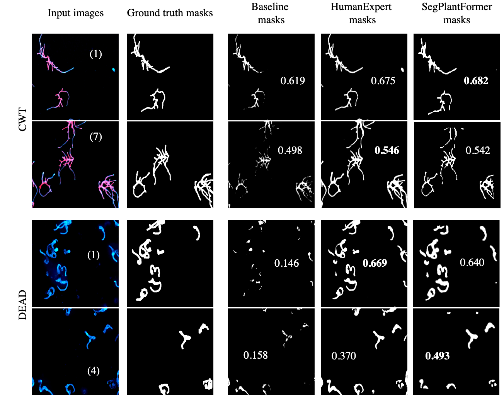

<h1 align="center">
  &nbsp;SegPlantFormer 🌱🔬<br>
</h1>
<h2 align="center">
A Transformer-Based Model for Plant Semantic Segmentation&nbsp;
</h2>

----

<a href="https://alkzar.cl/EVIC23_poster_segplantformer.pdf" target="_blank">[EVIC23 Poster]</a>
<a href="https://api.wandb.ai/links/alcazar90/7k7k0yph" target="_blank">[W&B blogpost]</a>
<a href="https://github.com/alcazar90/plant-segmentation/blob/main/single-segmentation.ipynb" target="_blank">[Usage]</a>

About this project;

> _With the advent of climate change and a growing population, food security will be a pressing issue in the coming years. To stay ahead, we need tools that help us fully understand the complex processes and functions of specific genes in plant cell biology, and how these genes influence plant growth and morphology. This requires the examination of countless cells or individual plants, especially given the variability in cellular behavior, which becomes critical when studying anomalies or emerging patterns that affect normal cell function and morphology. This task is challenging for individual cell analyses, even with technological advancements. Therefore, we introduce SegPlantFormer, a deep-learning model for high-content microscopy data analysis. Our approach enhances accuracy and mitigates manual biases by automating segmentation and classification. This is crucial for advancing our understanding of plant cell biology. Our focus is on fine-tuning the model’s ability to establish a robust thresholding method, allowing it to differentiate between living and non-living plants. SegPlantFormer surpasses traditional methods by accurately segmenting microscope images and distinguishing between dead and alive plants. Additionally, we introduce a unique plant cell biology dataset with manually annotated masks_..


<figure style="background-color: white">
  
  <figcaption><small>Figure 1. <b>Workflow for Creating a Labeled Image Dataset of P. patens for Semantic Segmentation in Deep Learning Model Training.</b> The workflow begins with automatic image acquisition using a Zeiss microscope, where images of Physcomitrium patens are captured as tiles (10x10). Images are then processed for labeling using the open-source software, Label Studio. Through manual semantic segmentation, each image is annotated with three distinct categories: Normal, Normal cut, and Noise. The annotated labels are generated as masks corresponding to specific image IDs. These labeled datasets, containing both the images and their respective masks, serve as input for training the segmentation model</small>
  </figcaption>
</figure>


<figure style="background-color: white">
  
  <figcaption><small>Figure 2. <b>Left:</b> The results of the laboratory experiments are captured in a large stacked image (25036 × 18954px) with high resolution microscopic imaging. The white squares with labels Aand B are samples that were taken. <b>Right:</b> Smaller image patches from the samples, such as (A1) and (B1), are the input images for the model. Then, we manually handcraft masks with semantic information from these images regarding the plant shapes associated with alive/dead cell labels (A2 and B2), elaboratin the dataset D</small></figcaption>
</figure>


<figure style="background-color: white">
  
  <figcaption><small>Figure 5. Test set observations, displayed in columns from left to right: input image patches and ground truth masks used for model supervision (X and y in Figure 2). Then, the predicted masks from Baseline, HumanExpert, and SegPlantFormer. The top two rows show CWT examples, where SegPlantFormer produces masks similar to HumanExpert, with IoU performance highlighted within the mask images. The bottom rows show Dead examples, where SegPlantFormer also demonstrates results comparable to HumanExpert. Each input image is labeled with a corresponding ID, matching the results reported in Table~\ref{tab:result-by-testset-obs}.</small></figcaption>
</figure>


## Get Started

TBC


## Citing

```
@misc{SegPlantFormer,
  authors = {Alcázar, Cristóbal}, {Chocano, Edward}, {Flores, Ricardo}, {Vidali, Luis}
  title = {SegPlantFormer: A Transformer-based Model for Plant Semantic Segmentation},
  year = {2023},
  publisher = {GitHub},
  journal = {GitHub repository},
  howpublished = {\url{https://github.com/alcazar90/plant-segmentation}},
}
```
