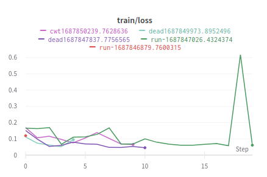
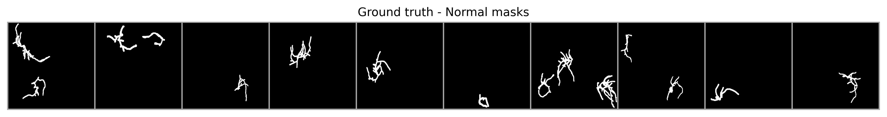

# Logbook

_Author: Cristóbal Alcázar_

> **tl;dr:** The following notes are intended to register activities and challenges during the development of the project, focusing on image segmentation. These logs document updates, analyses, and modifications made to the project's codebase, datasets, and evaluation methods.


### 11/09/2023

Update of Figures 3 and 4 in the document. Validation set images are observed and model-predicted masks are compared against traditional method masks.


<figure>
  
  <figcaption><small>Fig. 3. Rows from top to bottom correspond to the input image patches, label masks (ground truth), model prediction masks, and traditional method masks from the cwt plant dataset. The Intersection Over Union (IoU) metric for each of the five cases is reported within the image in the last two rows. In almost every case, the model predictions are superior to the current method. For instance, in the first column, the predicted mask reports 0.29 IoU w.r.t. a 0.42 IoU from the mask generated by the traditional method. These observations are in a subset that was not used to train the model—an overall mean IoU of 0.52 reports the predictions vs. 0.42 in the traditional method.</small></figcaption>
</figure>


<figure>
  
  <figcaption><small>Fig. 4. Rows from top to bottom correspond to the input image patches, label masks (ground truth), model prediction masks, and traditional method masks from the dead plant dataset. The Intersection Over Union (IoU) metric for each of the five cases is reported within the image in the last two rows. In every case, the model predictions are superior to the current method. For instance, in the first column, the predicted mask reports 0.65 IoU w.r.t. a 0.15 IoU from the mask generated by the traditional method. These observations are in a subset that was not used to train the model—an overall mean IoU of 0.47 reports the predictions vs. 0.25 in the traditional method.</small></figcaption>
</figure>


Modifications were made in `benchmarking.py`, in particular:

* An argument `--show_n_images` was added to display validation images with their respective masks predicted by the model and masks from the traditional method.
* Captions of the saved images were removed.


### 14/08/2023

* Analyzing alternative masks obtained by Edward's traditional method, but for the `dead` subset. It was found that the alternative masks are not black and white but rather grayscale images. Unlike the alternative masks for the `cwt` subset. This can be visualized in the `playground.ipynb` notebook, Evaluate Benchmark section, Dead dataset. **It will be necessary to use a threshold to determine when a pixel is white or black in the alternative masks.**
* This poses a trade-off between incorporating regions that are only noise and leaving areas that identify the objects of interest in the image. A threshold was used within collate_fn in the benchmarking.py script:
  ```python
      if alternative_masks:
        if dataset_type == 'dead':
            # apply threshold to get a binary masks (dead alternative mask -> grayscale)
            benchmark_masks = torch.where(benchmark_masks > 0.6, 1.0, 0.0)
        return images, targets, benchmark_masks
  ```
* Review observation `cwt4_55.jpg` from the training set where both the prediction and the alternative method mask have a value of 0.
* In addition to the CSV with the results per observation, images of the input, masks, predictions, and alternative method were generated to create a diagram with the following structure for observations in validation:
<center>

</center>
* Reconsidering the logic of the configuration to create training/validation sets for the different datasets (i.e., `cwt`, `dead`) that communicates between the train.py and benchmarking.py scripts to avoid consistency errors. For now, everything is delegated at the level of the arguments with which the script is called, which the user must provide with the same seed and checkpoint of the model that was trained on the training/validation partition generated by the seed.


### 12/08/2023

* The `get_pred_label` function was modified to collect alternative masks from the input dataloader when available by `PlantDataset(..., alternative_masks=True)`.
* The documentation of the `get_pred_label` function was improved for clearer usage.
* The use of `get_pred_label` in the `single-segmentation.ipynb` notebook was updated to return the output according to the new modifications.
* The `benchmarking.py` script loads a checkpoint, the dataset with alternative masks, and computes the IoU metrics for the alternative masks and the model predictions with the help of the `get_pred_label` function. It obtains an identifier for each observation and saves the IoU metrics per observation, both reported by the model and those proposed by the alternative masks, in a .csv file in the results folder named `benchmarking_<id>.csv`. Additionally, it obtains the number of masks associated with each observation and how many of these correspond to the signal to be detected (e.g., alive). The file with the results has the following structure:
    ```
    image_name,iou_model,iou_alternative,num_masks,normal_num_masks,split,model_ckpt
    cwt1_10.jpg,0.642349,0.53557384,4,1,train,ckpt/cwt-single-segmentation.pth
    cwt4_76.jpg,0.12558275,0.10311527,7,1,train,ckpt/cwt-single-segmentation.pth
    cwt4_55.jpg,0.0,0.0,5,1,train,ckpt/cwt-single-segmentation.pth
    cwt3_55.jpg,0.5076142,0.27609223,9,1,train,ckpt/cwt-single-segmentation.pth
    cwt3_16.jpg,0.55149746,0.48964947,4,1,train,ckpt/cwt-single-segmentation.pth
    cwt3_14.jpg,0.5455779,0.59192973,3,1,train,ckpt/cwt-single-segmentation.pth
    ```

### 23/07/2023

* The `benchmarking.py` file was created, which will be responsible for computing metrics on the dataset specified, loading a model checkpoint adjusted by the train.py script.
* Additionally, this script should be able to compute metrics using masks obtained by an alternative method using the modifications explained in the 22/07/2023 entry.


### 22/07/2023

* Functionality was added in `PlantDataset` to load additional masks computed by an external method (e.g., traditional method).
* The purpose of this functionality is to evaluate the metrics of a trained model and compare them with masks computed by the traditional method.
To load the additional masks, the PlantDataset class must be instantiated as follows:
```python
from dataset import PlantDataset, extract_ids_from_name

label2id = {'normal': 0, 'normal_cut': 1, 'noise': 2}
dataset = PlantDataset('data',
                       'cwt', 
                       'data_inventary.csv', 
                       label2id=label2id, 
                       alternative_masks=True)
```
* Then, the `__getitem__` method of the `PlantDataset` class returns a dictionary with the additional masks, and they can be accessed by their name:
```python
        if self.alternative_masks:
            alternative_mask_path = os.path.join(self.root, self.folder, 'original_labeled_imageJ_mask', self.alternative_masks[idx])
            return {
                'image': image,
                'masks': masks_path,
                'labels': labels,
                'alternative_masks': Image.open(alternative_mask_path)
            }
```

```python
dataset[10]['alternative_masks']
```
* Important note of the implementation: It is assumed that the traditional masks have a folder structure identical to the input images (i.e., `dataset[10][]`). That is, both the `subset/original` and `subset/original_labeled_imageJ_mask` folders have the same number of images, only their names are different. For example, `cwt1_1.jpg` and `cwt1_mask_1.jpg`. This is the reason for the indices used to extract the digits in the case of masks when the class is instantiated:
```python
        if alternative_masks: 
            self.alternative_masks = []
            alternative_masks_folder = os.listdir(os.path.join(self.root, self.folder, 'original_labeled_imageJ_mask'))
            alternative_masks_folder.sort(key=lambda x: (int(re.findall(r'\d+', x.split('_')[0])[0]), 
                                                int(re.findall(r'\d+', x.split('_')[2])[0])))
```
* The `collate_fn` function was modified to create additional DataLoaders by adding traditional masks and applying transformations to these so that they become tensors.
def collate_fn(batch, target_fn=get_binary_target, alternative_masks=False):
```python
def collate_fn(batch, target_fn=get_binary_target, alternative_masks=False):
    """
        Collate function to stack the masks as channels in the same tensor.
        get_target: function to get the target tensor from the masks and labels
            could be multi-labeling or binary.
        alternative_masks: if True, return the alternative masks for benchmarking
          in addition to the images, targets.
    """ 
    tfms = ToTensor()
    images = torch.cat([feature_extractor(example['image'], return_tensors='pt')['pixel_values'] for example in batch])
    if alternative_masks:
        # Resize to 512x512, then convert to grayscale and tensor. Finally, add 
        # a dimension for the channel (=1) with .unsqueeze(1) -> (B, 1, H, W)
        tfms_benchmark_masks = Compose([Grayscale(num_output_channels=1), ToTensor()])
        benchmark_masks = torch.cat([tfms_benchmark_masks(example['alternative_masks'].resize((512, 512))).unsqueeze(1) for example in batch])
    masks = [example['masks'] for example in batch]
    labels = [example['labels'] for example in batch]
    targets = torch.cat([target_fn(x[0], x[1], tfms, size=(512,512)) for x in zip(masks, labels)])

    # transformar a 1 cuando haya un entero distinto a 0 (semantic segmentation)
    targets = torch.where(targets > 0.0, 1.0, 0.0)
    if alternative_masks:
        return images, targets, benchmark_masks
    return images, targets
```

### 17/07/2023a

* Incorporated a way to load masks from the traditional method (base) in the PlantDataset class and be able to use it to evaluate metrics.
* Ricardo's meeting,
	* Edward's meeting, sub-masks from the normal_cut and noise class, turn them off from the label.
	* Use the previous filter,
	* Turn off with validation masks


### 27/06/2023

* The dataset was updated in the [shared Drive route](https://drive.google.com/drive/folders/1KltqueU8bUoAnXMqhKifbpMULspNwoZm?usp=drive_link) with all the masks from the dead dataset.
* Logging with W&B was enabled in the `train.py` script, to track metrics during training every time a different set of hyperparameters is used. You can see the W&B project [here](https://wandb.ai/alcazar90/plant-segmentation?workspace=user-alcazar90) and below are some of the visualizations available on the dashboard:


<table border=0 align=center>
    <tbody>
        <tr>
     	    <td width="33%" align="center"> </td>
   	      <td width="33%" align="center"> </td>
   	      <td width="33%" align="center"> </td>
        </tr>
    </tbody>
</table>

* Important note, a modification was made in the `get_pred_label` function, now it returns the images and probabilities apart from the label and prediction. It takes advantage of computing several things with the same function and avoids redundancy in traversing the dataloader.

```python
# currently
val_img, val_labels, val_preds, val_probs = get_pred_label(model, val_loader, device)
# before                                                           
preds, labels = get_pred_label(model, val_loader, device)
```

### 24/06/2023

* Regarding revisions of the `PlantDataset` class. It was verified that the current masks for the `dead` dataset were consistent with the folder structure. Although there is no complete labeling coverage, the dataset functions as expected. Now the same class can be used to instantiate the `cwt` and `dead` datasets with the same code.
* `PlantDataset.get_masks_per_labels` was updated to use a regex expression and identify the type of masks by the label in their name according to the `self._label2id` dictionary, before it was hardcoded for the `cwt` dataset.

```python
def get_masks_per_labels(self):
    """ Return the number of masks per label """
    pattern = ''.join([s + '-|' if idx < len(self._label2id)-1 else s for idx, s in enumerate(self._label2id.keys())])
    get_label = lambda x: re.findall(pattern, x)[0].replace('-', '')
    out = [get_label(m) for img in self.masks for m in img]
    return np.unique(out, return_counts=True)
```
* **Regarding the model training.** The `train.py` file was created where it contains only the necessary code to train a model and compute metrics during training. It computes intersection over union (IoU) to monitor and perform early stopping using the validation set. This is possible thanks to the `get_pred_label` function from the `evaluation.py` file, which collects predictions, labels, and logits from all observations in a dataloader in inference mode.

```python
# Collect predictions, labels, and logits from all observations in a dataloader
val_preds, val_labels, val_logits = get_pred_label(model, 
                                                   val_loader, 
                                                   device, 
                                                   return_logits=True)
```
* Other features of `train.py` are:
	* Using the `argparser` module to set hyperparameters and other training configurations via the command line.
	* Computing training metrics at the end of each epoch.
	* Computing metrics in validation given X number of gradient updates that are monitored by the `eval_steps` variable.
	* Saving model checkpoints each time the mean intersection over union metric of the entire validation set is improved.
	* Saving the IoU metric per observation in the validation set each time the validation pipeline is run in the `miou_<id>.csv` file in the results folder.
* For example, we can train a model as follows:

```bash
python train.py --bs 2 --epochs 20 --eval_steps 30 --lr 1e-3 --rep 2 --dataset cwt
python train.py --bs 2 --epochs 20 --eval_steps 30 --lr 1e-3 --rep 2 --dataset dead
```
Then, we can compute the mIoU from the `miou_<id>.csv` file directly from the terminal using `awk`:

```bash
awk -F',' '{sum=0; for(i=2; i<=NF; i++){sum+=$i} average=sum/(NF-1); print average}' ./results/miou_1.csv
```

### 23/06/2023

* The `PlantDataset(Dataset)` class was modified in `dataset.py` and a new parameter was added to initialize the class, `label2id`, which allows encoding the labels from the mask names when loaded from the folders. This allows greater flexibility to load masks from labels on different types of experiments, both `cwt` and `dead`, which have different labels. Below is an example of how to initialize the `PlantDataset` class depending on the case:

```python
# Instantiate the dataset with alive plants
label2id = {'normal': 0, 'normal_cut': 1, 'noise': 2}
cwt_dataset = PlantDataset('data', 'cwt', 'data_inventary.csv', label2id=label2id)

# Instantiate the dataset with dead plants
label2id = {'dead': 0, 'dead_cut': 1, 'noise': 2}
dead_dataset = PlantDataset('data', 'dead', 'data_inventary.csv', label2id=label2id)
```

### 15/06/2023

* After having the ability to memorize a batch of 4 images (previous section), and fine-tuning a couple of details in the training loop, fine-tuning was performed on the complete dataset. A learning rate of `1e-3` was used, and it was trained for 300 parameter update steps. A batch size of 2 images was used, and the dataset was split into 59 training images and 10 for validation.
* The mean Intersection over Union (mIoU) on the validation set was monitored every 25 parameter update steps, and a model checkpoint was saved each time a better metric was achieved. Without elaborate hyperparameter adjustments, a model was obtained that reported a mIoU of 0.53 on the validation set.
* Instead of continuing to experiment and train the model, the previous checkpoint was used in the "Load a checkpoint & compute metrics" section to compute and analyze a more in-depth evaluation of the model.
* `get_pred_label(model, val_loader, device)` is used to collect the model predictions and labels given the validation set's dataloader. This information allows quickly computing the IoU for each example in the validation set.


```python
# Collect the predictions of a model and labels from a dataloader
preds, labels = get_pred_label(model, val_loader, device)

# Compute IoU per example
val_iou = compute_iou(preds, labels)
print("IoU per each validation example:\n")
val_iou
> IoU per each validation example:

> tensor([0.6895, 0.4673, 0.7664, 0.0026, 0.5333, 0.4500, 0.6005, 0.7132, 0.3637,
        0.6716])
```
<center>



</center>

* In general, the results are quite good, 6/10 images have an IoU greater than 0.5, and 3/10 have an IoU greater than 0.6.
* An error was detected in the mask of image 4, which reports an IoU of 0.0026. This is because the mask of image 4 has a `normal` label that does not match the original image. This affects the overall IoU average, and it must be taken into account for future evaluations.
* Images 2, 5, 7, 9 show that the model predicts additional information not present in the masks, which means the model is predicting the other masks with `normal-cut` and `noise` labels. Therefore, this can be a good sign if these additional masks are incorporated to control this, and it would mean that the IoU metric would increase in these cases, considering everything else constant.
* In the next iteration, continue improving the model evaluation and compute the following metrics summarized in Figure 6.27 of Szeliski's book on computer vision, which is shown below:

<center>

</center>


### 14/06/2023

* In the `single-segmentation.ipynb` file, a model can be trained on the `cwt` dataset, only to detect the `normal` label. When creating the target from the masks, `get_binary_mask` is used to convert the masks associated with the `normal` label to 1 and the rest of the labels to 0.
* In the following image, you can see the result of overfitting segmentation on a batch of 4 images with the `normal` label:

<center>


</center>

* It is important to verify after training on the complete dataset, the influence of elements such as `normal-cut` or `noise`.
* It must be possible to compute the IoU metric for each prediction, so that it can then be used both in the validation and test sets, to classify predictions given a certain threshold as correct or incorrect. This will allow computing other metrics such as precision and recall.


